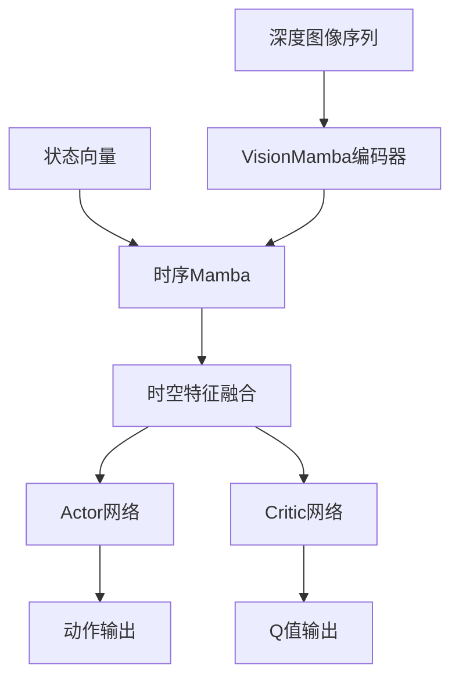

# AirSim 强化学习无人机导航项目

[](https://www.python.org/)
[](https://pytorch.org/)
[](https://microsoft.github.io/AirSim/)
[](LICENSE)

本项目实现了一个基于AirSim模拟器的无人机导航强化学习框架，支持多种先进的深度强化学习算法，特别是针对视觉导航任务的TD3变体。

## ⚠️ 免责声明

**本仓库为作者的个人学习项目，主要用于强化学习算法研究和技术积累。代码和实现仅供参考学习，不保证生产环境适用性。欢迎交流学习，但请尊重作者劳动成果。**

## 🚁 项目概述

本项目提供了一个完整的无人机强化学习训练和评估框架，主要特点包括：

- **真实物理模拟**: 基于Microsoft AirSim的高保真无人机物理模拟
- **多模态输入**: 支持深度图像、灰度图像和状态信息的融合输入
- **先进算法**: 实现了多种TD3变体，包括基于Mamba和Vision Transformer的最新算法
- **时序建模**: 支持RNN、LSTM、GRU以及状态空间模型(SSM)等时序建模方法
- **环境随机化**: 内置环境参数随机化，提高策略泛化能力

## 🧠 算法架构

### 核心算法分类

#### 1. 基础TD3算法
- **TD3**: 标准双延迟深度确定性策略梯度算法
- **AETD3**: 自适应集成TD3，使用多个Critic网络提高稳定性
- **PER TD3**: 优先经验回放TD3，智能采样重要经验

#### 2. 循环神经网络变体
- **GRU TD3**: 门控循环单元TD3，处理时序依赖
- **LSTM TD3**: 长短期记忆TD3，长期时序建模
- **CFC TD3**: 闭式连续时间TD3，高效时序处理

#### 3. 先进的视觉架构
- **ST-CNN TD3**: 时空卷积神经网络，时空特征提取
- **VMamba TD3**: 基于状态空间模型的视觉架构
- **VMamba TD3 No Cross**: 无交叉注意力的VMamba变体
- **ST-VMamba TD3**: 时空VMamba，结合空间和时间建模

#### 4. 基于Mamba的最新架构 ⭐
- **ST-Mamba TD3**: 时空Mamba，高效时空建模
- **ST-VimTD3**: 时空Vision Mamba，最新的视觉状态空间模型

### 算法架构对比

| 算法 | 时序处理 | 视觉编码器 | 特点 |
|------|----------|------------|------|
| TD3 | 无 | CNN | 基础算法，帧堆叠 |
| GRU/LSTM TD3 | RNN | CNN | 循环时序建模 |
| VMamba TD3 | Mamba | VMamba | 状态空间模型 |
| ST-Mamba TD3 | Mamba | VisionMamba | 时空一体化处理 |
| ST-VimTD3 | TemporalMamba | VisionMamba | 分层时空处理 |

## 🎯 环境设计

### 观测空间
```python
observation_space = {
    "depth": (seq_len, 128, 128),    # 深度图像序列
    "gray": (seq_len, 128, 128),     # 灰度图像序列  
    "base": (10,)                     # 状态向量
}
```

**状态向量组成**:
- `[dx, dy]`: 相对目标位置
- `[altitude]`: 当前高度
- `[forward_speed, z_velocity, yaw_rate]`: 速度信息
- `[pitch, roll, yaw]`: 姿态角度
- `[relative_angle_to_target]`: 朝向目标角度

### 动作空间
```python
action_space = Box(
    low=[min_forward_speed, -max_vertical_speed, -max_yaw_rate],
    high=[max_forward_speed, max_vertical_speed, max_yaw_rate],
    dtype=np.float32
)
```

**动作含义**:
- `forward_speed`: 前进速度 [0.0, 2.0] m/s
- `z_velocity`: 垂直速度 [-0.5, 0.5] m/s  
- `yaw_rate`: 偏航角速度 [-π/12, π/12] rad/s

### 奖励函数设计

奖励函数综合考虑多个因素：

1. **距离奖励**: `-distance × 0.02` (鼓励接近目标)
2. **朝向奖励**: `speed × cos(yaw_error)` (鼓励朝向目标飞行)
3. **成功奖励**: `+20` (到达目标)
4. **碰撞惩罚**: `-20` (发生碰撞)
5. **超时惩罚**: `-30` (超过最大步数)
6. **步数惩罚**: `-0.01` (鼓励效率)
7. **急动惩罚**: 惩罚动作突变，提高飞行平稳性
8. **曲率惩罚**: 惩罚急转弯，优化轨迹
9. **高度惩罚**: 超出安全高度范围时施加惩罚

## 🛠️ 安装指南

### 环境要求
- Python 3.8+
- PyTorch 1.9+
- CUDA 11.0+ (GPU训练推荐)
- Unreal Engine 4.27+ (AirSim依赖)
- AirSim Binary

### 安装步骤

1. **克隆项目**
```bash
git clone https://github.com/yimu1225/airsim_rl.git
cd airsim_rl
```

2. **安装AirSim**
```bash
# 按照官方指南安装AirSim
# https://microsoft.github.io/AirSim/build_linux/
```

3. **安装Python依赖**
```bash
pip install -r requirements.txt
```

4. **编译Mamba组件** (可选，用于Mamba算法)
```bash
cd Vim/mamba-1p1p1
pip install -e .
```

## 🚀 快速开始

### 基础训练

```bash
# 训练标准TD3算法
python main_async.py --algorithm_name td3 --max_timesteps 1000000

# 训练LSTM TD3算法
python main_async.py --algorithm_name lstm_td3 --max_timesteps 1000000

# 训练ST-VimTD3算法
python main_async.py --algorithm_name ST-VimTD3 --max_timesteps 1000000
```

### 批量训练

```bash
# 训练所有基础算法
python main_async.py --algorithm_name "td3,aetd3,per_td3" --max_timesteps 500000

# 训练所有时序算法
python main_async.py --algorithm_name "gru_td3,lstm_td3,cfc_td3" --max_timesteps 500000

# 训练所有Mamba算法
python main_async.py --algorithm_name "vmamba_td3,st_vmamba_td3,st_mamba_td3,ST-VimTD3" --max_timesteps 500000
```

### 评估模型

```bash
# 评估训练好的模型
python eval_SAC.py --model_dir path/to/model --algorithm_name ST-VimTD3
```

## ⚙️ 配置参数

### 关键配置项

```python
# 算法参数
parser.add_argument("--algorithm_name", type=str, default='ST-VimTD3')
parser.add_argument("--hidden_dim", type=int, default=256)
parser.add_argument("--buffer_size", type=int, default=20000)
parser.add_argument("--batch_size", type=int, default=256)
parser.add_argument("--gamma", type=float, default=0.98)
parser.add_argument("--tau", type=float, default=0.005)

# 环境参数
parser.add_argument("--episode_length", type=int, default=200)
parser.add_argument("--min_forward_speed", type=float, default=0.0)
parser.add_argument("--max_forward_speed", type=float, default=2.0)
parser.add_argument("--max_vertical_speed", type=float, default=0.5)
parser.add_argument("--max_yaw_rate", type=float, default=np.pi/12)

# ST-VimTD3特定参数
parser.add_argument("--st_mamba_embed_dim", type=int, default=192)
parser.add_argument("--st_mamba_depth", type=int, default=6)
parser.add_argument("--st_mamba_patch_size", type=int, default=16)
parser.add_argument("--st_mamba_temporal_depth", type=int, default=2)
```

### 算法特定配置

#### ST-VimTD3配置
```python
# 视觉编码器参数
st_mamba_embed_dim=192        # 嵌入维度
st_mamba_depth=6               # VisionMamba层数
st_mamba_patch_size=16         # 图像块大小
st_mamba_d_state=16           # SSM状态维度

# 时序处理参数
st_mamba_temporal_depth=2      # 时序Mamba层数
seq_len=4                     # 序列长度
```

#### 网络架构


## 📊 性能分析

### 算法对比

| 算法 | 收敛速度 | 稳定性 | 计算效率 | 内存占用 |
|------|----------|--------|----------|----------|
| TD3 | 中等 | 中等 | 高 | 低 |
| LSTM TD3 | 慢 | 高 | 中等 | 中等 |
| VMamba TD3 | 快 | 高 | 中等 | 中等 |
| ST-VimTD3 | 快 | 很高 | 低 | 高 |

### 训练曲线


## 🧪 实验设置

### 环境配置
- **模拟器**: AirSim with Unreal Engine
- **无人机**: Quadrotor模型
- **传感器**: 深度相机 (128×128)
- **训练频率**: 20Hz
- **最大episode长度**: 200步

### 随机化策略
- **目标位置**: 随机采样
- **环境参数**: 动态调整难度
- **初始条件**: 随机起始位置和姿态

## 🔧 开发指南

### 添加新算法

1. 在`algorithm/`目录下创建新文件夹
2. 实现`networks.py`定义网络架构
3. 实现`agent.py`定义算法逻辑
4. 在`__init__.py`中注册算法
5. 在`config.py`中添加参数

### 自定义环境

1. 修改`gym_airsim/envs/AirGym.py`
2. 调整观测空间和动作空间
3. 自定义奖励函数
4. 配置环境参数

## 📁 项目结构

```
airsim_rl/
├── algorithm/                 # 算法实现
│   ├── td3/                  # 基础TD3
│   ├── lstm_td3/             # LSTM TD3
│   ├── gru_td3/              # GRU TD3
│   ├── vmamba_td3/           # VMamba TD3
│   ├── st_mamba_td3/         # 时空Mamba TD3
│   ├── ST_VimTD3/           # 时空Vision Mamba TD3
│   └── ...
├── gym_airsim/              # AirSim环境包装
├── Vim/                     # Vision Mamba实现
├── vmamba/                  # VMamba实现
├── config.py                # 配置参数
├── main_async.py             # 主训练脚本
├── eval_SAC.py              # 评估脚本
└── requirements.txt          # 依赖列表
```

## 🐛 故障排除

### 常见问题

1. **AirSim连接失败**
   ```bash
   # 检查AirSim是否正确启动
   # 确认IP和端口配置
   python main_async.py --airsim_ip 127.0.0.1 --airsim_port 41451
   ```

2. **CUDA内存不足**
   ```bash
   # 减小batch size
   python main_async.py --batch_size 64
   ```

3. **Mamba编译错误**
   ```bash
   # 确保安装了正确的CUDA版本
   cd Vim/mamba-1p1p1
   pip install -e . --verbose
   ```

### 性能优化

- 使用GPU训练加速
- 调整序列长度平衡性能和效果
- 使用混合精度训练减少内存占用

## 📄 许可证

本项目采用MIT许可证 - 详见[LICENSE](LICENSE)文件

## 🤝 贡献

欢迎提交Issue和Pull Request！

1. Fork项目
2. 创建特性分支 (`git checkout -b feature/AmazingFeature`)
3. 提交更改 (`git commit -m 'Add some AmazingFeature'`)
4. 推送到分支 (`git push origin feature/AmazingFeature`)
5. 开启Pull Request

## 📚 参考文献

- **TD3**: [Addressing Function Approximation Error in Actor-Critic Methods](https://arxiv.org/abs/1802.09477)
- **Mamba**: [Mamba: Linear-Time Sequence Modeling with Selective State Spaces](https://arxiv.org/abs/2312.00752)
- **Vision Mamba**: [Vision Mamba: Efficient Visual Representation Learning with Bidirectional State Space Model](https://arxiv.org/abs/2401.13666)
- **AirSim**: [AirSim: High-Fidelity Visual and Physical Simulation for Unmanned Aerial Vehicles](https://arxiv.org/abs/1705.09530)
